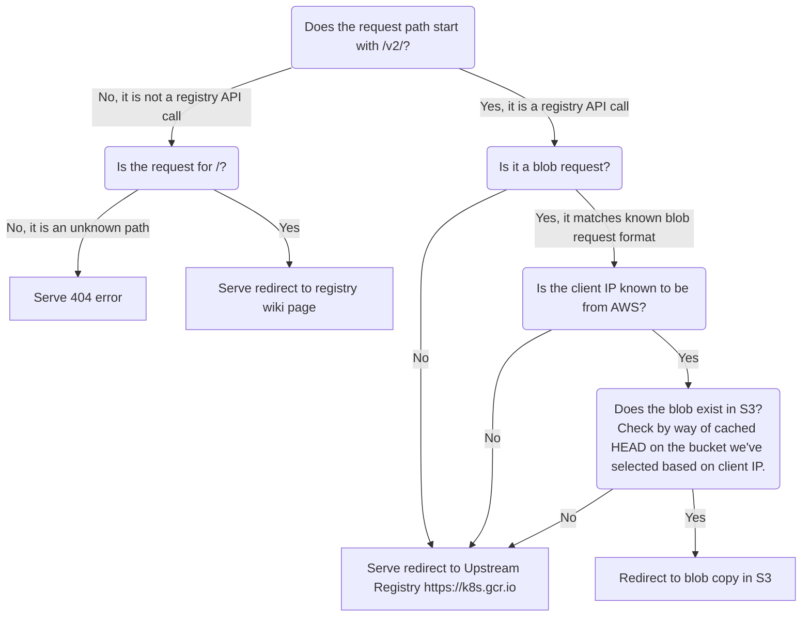

# Request Handling

Requests to archeio follows the following flow:

1. If it's a request for `/`: redirect to our wiki page about the project
2. If it's not a request for `/` and does not start with `/v2/`: 404 error
3. For registry API requests, all of which start with `/v2/`:
  - If it's not a blob request: redirect to Upstream Registry
  - If it's not a known AWS IP: redirect to Upstream Registry
  -  If it's a known AWS IP AND HEAD request for the layer succeeeds in S3: redirect to S3
  -  If it's a known AWS IP AND HEAD fails: redirect to Upstream Registry

Currently the `Upstream Registry` is https://k8s.gcr.io.

Or in chart form:

