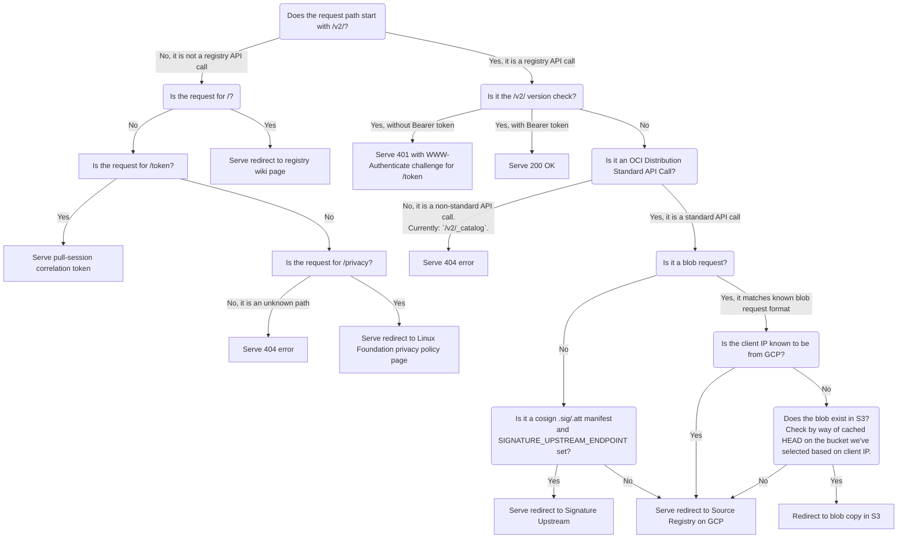

# Request Handling

Requests to archeio follows the following flow:

1. If it's a request for `/`: Redirect to our wiki page about the project
1. If it's a request for `/privacy`: Redirect to Linux Foundation privacy policy page
1. If it's a request for `/token`: Serve a pull-session correlation token (see [Trace Correlation](#trace-correlation) below)
1. If it's not a request for `/`, `/privacy` or `/token` and does not start with `/v2/`: 404 error
1. For registry API requests, all of which start with `/v2/`:
   - If it's the version check (`/v2/` or `/v2`) without a `Bearer` token: 401 error with a `WWW-Authenticate` challenge pointing at `/token`
   - If it's the version check with a `Bearer` token: 200 OK
   - If it's a non-standard API call (`/v2/_catalog`): 404 error
   - If it's a cosign signature/attestation manifest request (`sha256-*.sig` or `sha256-*.att`) and `SIGNATURE_UPSTREAM_ENDPOINT` is set: Redirect to Signature Upstream
   - If it's a manifest request: Redirect to Upstream Registry
   - If it's from a known GCP IP: Redirect to Upstream Registry
   - If it's a known AWS IP AND HEAD request for the layer succeeds in S3: Redirect to S3
   - If it's a known AWS IP AND HEAD fails: Redirect to Upstream Registry

See also: OCI Distribution [Specification](https://github.com/opencontainers/distribution-spec/blob/main/spec.md)

Currently the `Upstream Registry` is a region specific Artifact Registry backend.
The `Signature Upstream` is an optional single canonical registry (configured via `SIGNATURE_UPSTREAM_ENDPOINT`) used to serve cosign signatures and attestations from one location, avoiding the need to replicate them across all regions.

## Trace Correlation

Archeio uses the standard [docker/distribution token flow](https://distribution.github.io/distribution/spec/auth/token/)
purely for trace correlation, not authentication: all backing content is publicly readable.

1. The `/v2/` version check returns `401` with
   `WWW-Authenticate: Bearer realm="https://<host>/token",service="<host>"`.
2. The client fetches `/token`, which issues `{"token": "<128-bit hex trace ID>", "expires_in": 3600}`.
   The requested `scope` (repository name) is logged alongside the issued ID.
3. The client then sends `Authorization: Bearer <trace ID>` on every subsequent
   request of the pull, giving all requests in one pull session a single
   consistent correlation ID without any client changes.

For every `/v2/` request the resolved trace ID (in priority order: valid `Bearer`
token, `traceparent`, `X-Cloud-Trace-Context`, freshly generated) is:

- echoed back to the client in the `X-Request-ID` response header
- included as `traceID` in archeio's structured logs
- appended to every redirect `Location` as the `rid` query parameter, and to the
  outbound S3 blob existence `HEAD` probe, so backend/CDN access logs can be
  joined back to archeio's logs

Notes:

- Bearer token values are client-controlled and strictly validated as 32 hex characters before use.
- Standard clients strip the `Authorization` header when following redirects to
  other hosts, so the correlation token never reaches the backends.
- The `rid` query parameter must be excluded from CDN cache keys (but kept in
  access logs) to avoid cache fragmentation.
- The blob existence cache is keyed on the bare blob URL, unaffected by trace IDs.

Or in chart form:

```mermaid
flowchart TD

A(Does the request path start with /v2/?) -->|No, it is not a registry API call| B(Is the request for /?)
B -->|No| P[Is the request for /token?]
P -->|Yes| Q[Serve pull-session correlation token]
P -->|No| D[Is the request for /privacy?]
D -->|No, it is an unknown path| C[Serve 404 error]
D -->|Yes| K[Serve redirect to Linux Foundation privacy policy page]
B -->|Yes| E[Serve redirect to registry wiki page]
A -->|Yes, it is a registry API call| R(Is it the /v2/ version check?)
R -->|Yes, without Bearer token| S[Serve 401 with WWW-Authenticate challenge for /token]
R -->|Yes, with Bearer token| T[Serve 200 OK]
R -->|No| L(Is it an OCI Distribution Standard API Call?)
L -->|No, it is a non-standard API call.<br>Currently: `/v2/_catalog`.| M[Serve 404 error]
L -->|Yes, it is a standard API call| F(Is it a blob request?)
F -->|No| N(Is it a cosign .sig/.att manifest<br/>and SIGNATURE_UPSTREAM_ENDPOINT set?)
N -->|Yes| O[Serve redirect to Signature Upstream]
N -->|No| G[Serve redirect to Source Registry on GCP]
F -->|Yes, it matches known blob request format| H(Is the client IP known to be from GCP?)
H -->|Yes| G
H -->|No| I(Does the blob exist in S3?<br/>Check by way of cached HEAD on the bucket we've selected based on client IP.)
I -->|No| G
I -->|Yes| J[Redirect to blob copy in S3]
```

This allows us to efficiently serve traffic in the most local copy available
based on the cloud resource funding the Kubernetes project receives.
